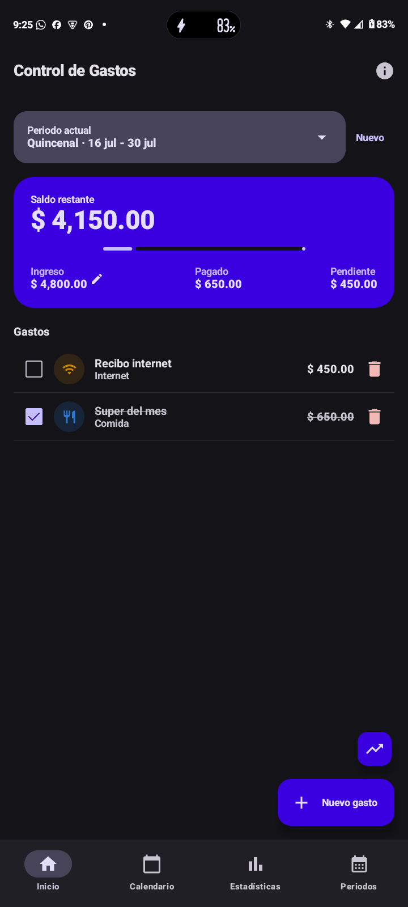
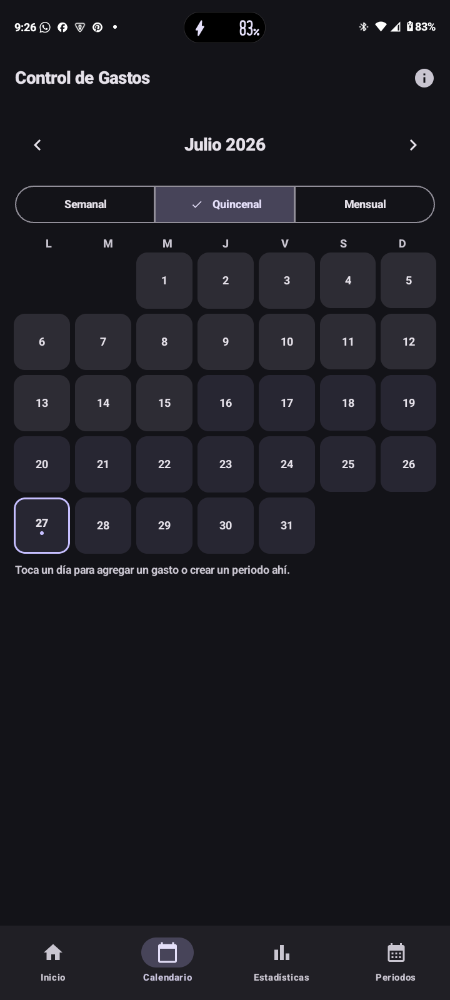
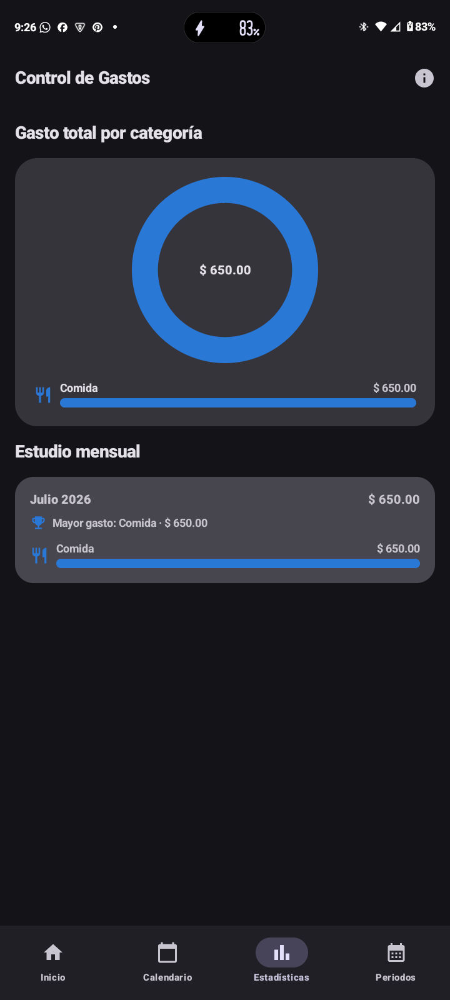
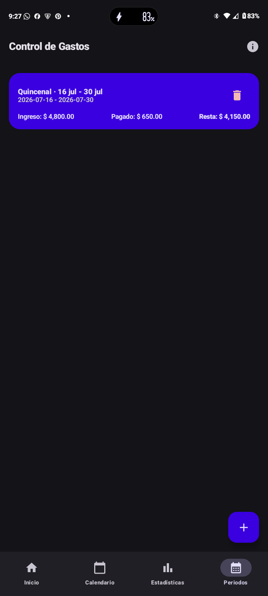
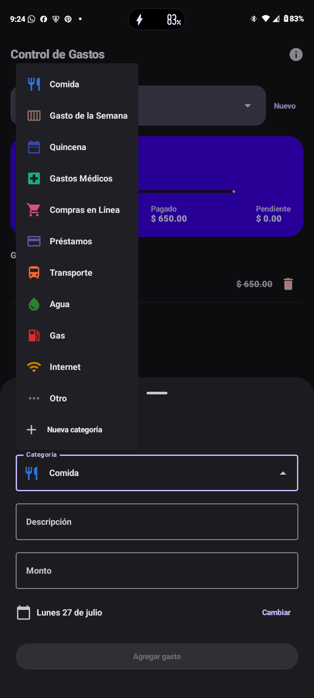
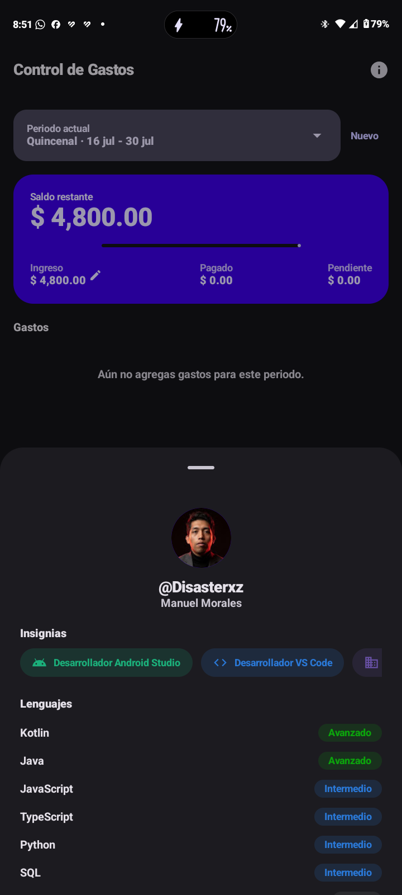

<div align="center">

# 💰 Control de Gastos

**A local-first personal finance tracker for Android, built with Jetpack Compose & Material 3.**

[](https://kotlinlang.org)
[](https://developer.android.com/guide/topics/resources/available-resources)
[](https://developer.android.com/jetpack/compose)
[](https://developer.android.com/training/data-storage/room)
[](LICENSE)
[](../../releases)

🇪🇸 [Español](#-español) &nbsp;·&nbsp; 🇬🇧 [English](#-english)

### 🔜 ¡Muy pronto en Google Play! &nbsp;/&nbsp; Coming very soon to Google Play!

</div>

---

## 🇪🇸 Español

**Control de Gastos** es una aplicación de Android para llevar el control de tus finanzas personales de forma **100% local** — sin cuentas, sin nube, sin conexión a internet requerida. Todos tus periodos, gastos, ingresos y categorías se guardan únicamente en tu teléfono, en una base de datos privada de la app.

### ✨ Características

- **Periodos flexibles**: crea periodos Semanales, Quincenales o Mensuales con su propio ingreso base. Las quincenas siguen el estándar de nómina mexicano (días 1–15 y 16–30).
- **Checklist de gastos**: agrega gastos por categoría y márcalos como pagados; el saldo restante se actualiza al instante.
- **Ingresos extra**: registra dinero adicional (bonos, préstamos, etc.) de forma independiente al ingreso base del periodo, y edita el ingreso base cuando lo necesites.
- **Categorías personalizadas**: 11 categorías predeterminadas (Comida, Transporte, Gastos Médicos, Internet, etc.) más la posibilidad de crear las tuyas con ícono y color propios.
- **Calendario navegable**: explora meses anteriores y futuros, visualiza qué días pertenecen a cada quincena/semana/mes y agrega gastos o periodos directamente desde un día.
- **Estadísticas**: gráfica de dona y barras por categoría, más un estudio mensual de en qué gastaste más.
- **Moneda en Pesos Mexicanos**: formato de moneda fijo, sin depender de la configuración regional del teléfono.
- **Material Design 3**: tema claro/oscuro, color dinámico (Android 12+) y animaciones de movimiento en toda la app.
- **100% offline**: ningún dato sale de tu teléfono.

### 📱 Capturas de pantalla

| Inicio | Calendario | Estadísticas |
|---|---|---|
|  |  |  |

| Periodos | Categorías | Créditos / Perfil |
|---|---|---|
|  |  |  |

### 🛠️ Stack técnico

| Componente | Tecnología |
|---|---|
| Lenguaje | Kotlin |
| UI | Jetpack Compose + Material 3 |
| Base de datos | Room (SQLite) |
| Navegación | Navigation Compose |
| Arquitectura | MVVM (ViewModel + StateFlow) |
| Imágenes | Coil |
| Build | Gradle (Kotlin DSL), AGP |

### 📊 Lenguajes del proyecto

```
Kotlin  ███████████████████████████████████████░  97.3%
XML     █░░░░░░░░░░░░░░░░░░░░░░░░░░░░░░░░░░░░░░░   2.7%
```

Toda la lógica, UI y arquitectura de la app está escrita en **Kotlin** (Jetpack Compose incluido); el XML solo se usa para recursos propios de Android (manifest, temas, colores, ícono adaptativo).

### ⬇️ Instalación

Descarga el APK más reciente desde la sección [**Releases**](../../releases) de este repositorio e instálalo en tu dispositivo Android (mínimo Android 10 / API 29).

> 🔜 **Próximamente disponible en Google Play.**
>
> <a href="../../releases"></a>

### 🧑‍💻 Compilar el proyecto

```bash
git clone https://github.com/ManuelDxz/ControlDeGastos.git
cd ControlDeGastos
./gradlew assembleDebug
```

El APK generado queda en `app/build/outputs/apk/debug/`.

---

## 🇬🇧 English

**Control de Gastos** ("Expense Control") is an Android app for tracking personal finances **entirely on-device** — no accounts, no cloud, no internet connection required. Every period, expense, income entry, and category is stored only on your phone, in the app's private local database.

### ✨ Features

- **Flexible periods**: create Weekly, Biweekly, or Monthly periods, each with its own base income. Biweekly periods follow the standard Mexican payroll split (days 1–15 and 16–30).
- **Expense checklist**: add expenses by category and check them off as paid; the remaining balance updates instantly.
- **Extra income**: log additional money (bonuses, loans, etc.) independently from the period's base income, and edit the base income whenever you need to.
- **Custom categories**: 11 built-in categories (Food, Transportation, Medical, Internet, etc.) plus the ability to create your own with a custom icon and color.
- **Browsable calendar**: navigate past and future months, see which days belong to each biweekly/weekly/monthly period, and add expenses or periods straight from a given day.
- **Statistics**: a donut + bar chart broken down by category, plus a monthly study of where you spent the most.
- **Mexican Peso formatting**: currency is always formatted as MXN, regardless of the device's system locale.
- **Material Design 3**: light/dark theme, dynamic color (Android 12+), and motion animations throughout.
- **100% offline**: no data ever leaves your phone.

### 📱 Screenshots

| Home | Calendar | Statistics |
|---|---|---|
|  |  |  |

| Periods | Categories | Credits / Profile |
|---|---|---|
|  |  |  |

### 🛠️ Tech stack

| Component | Technology |
|---|---|
| Language | Kotlin |
| UI | Jetpack Compose + Material 3 |
| Database | Room (SQLite) |
| Navigation | Navigation Compose |
| Architecture | MVVM (ViewModel + StateFlow) |
| Image loading | Coil |
| Build | Gradle (Kotlin DSL), AGP |

### 📊 Project languages

```
Kotlin  ███████████████████████████████████████░  97.3%
XML     █░░░░░░░░░░░░░░░░░░░░░░░░░░░░░░░░░░░░░░░   2.7%
```

All app logic, UI, and architecture is written in **Kotlin** (Jetpack Compose included); XML is only used for Android's own resource files (manifest, themes, colors, adaptive icon).

### ⬇️ Installation

Grab the latest APK from this repo's [**Releases**](../../releases) page and install it on an Android device (Android 10 / API 29 or newer).

> 🔜 **Coming soon to Google Play.**
>
> <a href="../../releases"></a>

### 🧑‍💻 Building from source

```bash
git clone https://github.com/ManuelDxz/ControlDeGastos.git
cd ControlDeGastos
./gradlew assembleDebug
```

The generated APK will be in `app/build/outputs/apk/debug/`.

---

<div align="center">

### 👤 Créditos / Credits

**Manuel Morales** ([@Disasterxz](https://github.com/ManuelDxz)) — Independent Developer
Collaborator at **[Decimal Solution](https://decimalsolution.com/)**

Licensed under the [MIT License](LICENSE).

</div>
